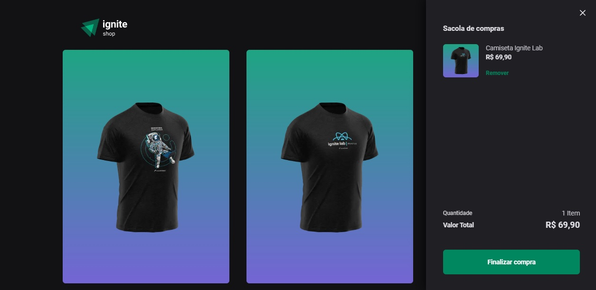

# Ignite Shop


This project was developed during the [Rocketseat's](https://www.rocketseat.com.br) Ignite BootCamp.

Developed with `NextJS`, `Typescript`, `Stripe`, `Axios` and `Stitches React`.

<p align=center>
  
</p>

## 💻 Run The Project

```bash
# Install the Dependencies
$ npm install
```

## Stripe Config
* Create a [Stripe Account](https://dashboard.stripe.com)
* Register products in the Stripe
* Create a `.env.local` file in project directory
* Save the Stripe Public and Secret Key in `.env.local` as below

```title:Env
# App
NEXT_URL=http://localhost:3000

# Stripe
STRIPE_PUBLIC_KEY=
STRIPE_SECRET_KEY=
```


```bash
# Run the Web Application
$ npm run dev
```
